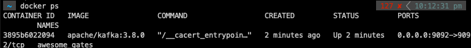
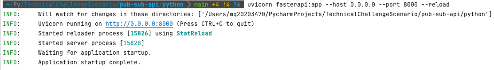

# Technical Challenge Scenario

## Develop an API using FastAPI that receive Customer(Contact) events (Contact creation and update). The API sends these events to the Kafka topic.

### Initialise the Kafka topic

    docker run -p 9092:9092 apache/kafka:3.8.0
### Identify the Docker Container name 

    docker exec -it 3895b6022094 /bin/sh

    /opt/kafka/bin/kafka-console-consumer.sh --bootstrap-server localhost:9092 --topic salesforce_contact_events --from-beginning

Initialise the Program, contacting FastAPI Client and Pubsub Client

    ./start-app.sh 

### This package will run two python scripts  
- uvicorn main:app --reload  
- python3 PubSubAPIClient.py  

Open Fast API

navigate to TechnicalChallengeScenario/pub-sub-api/python  
Run the following to generate the fast api portal:

    uvicorn fasterapi:app --host 0.0.0.0 --port 8000 --reload

Navigate to http://0.0.0.0:8000/docs

Short Description for Readme:
This Python script, PubSubAPIClient.py, acts as a client for interacting with Salesforce's Pub/Sub API.   
It subscribes to a specific topic (/data/ContactChangeEvent) to receive notifications about Contact data changes and publishes the decoded events to a Kafka topic (salesforce_contact_events).

    python3 PubSubAPIClient.py  